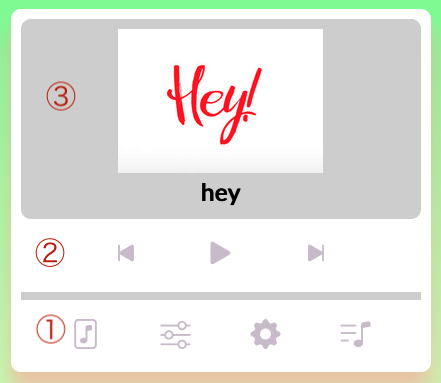
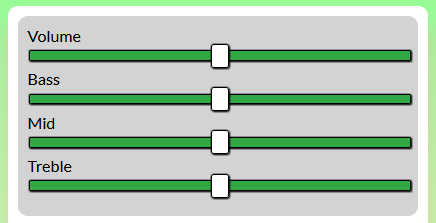
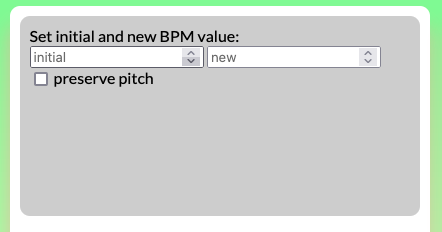
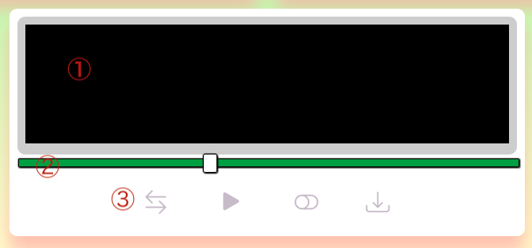
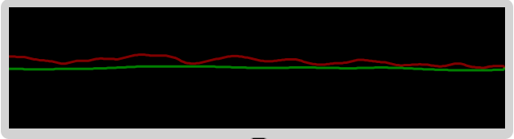

# Music Player
> Ein Projekt um simple Musik zu mixen, zu filtern, zu visualisieren und herunterzuladen.

## Inhaltsverzeichnis
* [Beschreibung](#beschreibung)
* [Features](#features)
* [Installation](#installation)
* [Technologien](#technologien)
* [Autoren](#autoren)

## Beschreibung

Die Anwendung besteht aus zwei Musik-Playern die unabhängig voneinander konfiguriert werden können. Das Ergibnis der aktuell abgespielten Musik wird dabei visualisiert und kann manipuliert und heruntergeladen werden.

## Features

### 1 Musik-Player


Jeder Musik-Player besteht aus `1` einem [Menü](#11-menu), `2` einem [Song Menü](#12-song-menu) und `3` einer Anzeige für den ausgewählten [Menü](#11-menu)-Unterpunkt.

#### 1.1 Menu


Beide musik Player haben ein Menü um einzelne Features auf zurufen. `1` ist beim start ausgewählt und zeigt den [Song](#111-song). `2` führt zu den [Filtern](#112-filter). `3` ermöglicht die [Einstellungen](#113-einstellungen) und `4` führt zu [Songauswahl](#114-songauswahl).

#### 1.1.1 Song

Song zeigt ein **Bild** zum aktuellen Song an sowie den dazu gehörige Song **Titel**.

#### 1.1.2 Filter


Die Filter lassen sich alle über Silder verwenden. Das bewegen nach **links verringert** während das bewegen nach **rechts verstärkt**. Der Slider unter **Volume** verändert die **Lautstärke** des jewiligen Songs. **Bass** verändert die **tiefen Frequenzen**, **Mid** verändert die **mittleren Frequenzen** und während **Treble** verändert die **hohen Frequenzen** **?**.

#### 1.1.3 Einstellungen


Mit anklicken der Checkboxen ist es möglich nur bestimmte Songs auszuwählen. In jeder zeile befindet sich dabei zunächst der Titel von dem Song und dahinter die checkbox. Durch anklicken der Checkboxen kann die asuwahl geändert werden. Wenn in der Checckbox ein Häckchen gesetzt ist wird der Song dabei abgespielt, anderen falls nicht.

#### 1.1.4 Songauswahl


noch keine Funktionalität.

### 1.2 Song Menu


Über dem [Menü](#11-menu) befindet sich noch ein Menü um das abspielen von dem Song zu steuern. `1` ist zum starten und stoppen vom Lied. `2` und `3` um zwischen den einzelnen Liedern zu wechseln. `2` wechselt dabei zum vorherigen Lied und `3` zum nächsten. Unter diesen knöpfen befindet sich noch ein Slider `4` welcher anzeigt wie weit das aktuelle Lied schon abgespielt ist. Außerdem kann auch an eine stelle auf dem Silder geklickt werden um an diese stelle zu springen.

### 2 Master-Controller / Visualizer


Der Master-Controller besteht aus einem `1` [Visulizer](#22-visulizer), `2` aus einem [Silder](#23-silder) und `3` aus einem [Menü](#21-visulizer-menu).

#### 2.1 Visulizer Menu


Das Visulzer Menü besteht aus 4 Knöpfen `1` ermöglicht es, wenn nur einer der Beiden [Player](#1-music-player) spielt zwischen diesen zu wechseln. `2` ermöglicht es beide [Music Player](#1-music-player) gleichzeitig zu starten und zu stoppen. `3` ändert die anzeige art im [Visulizer](#22-visulizer), wenn der Kreis sich links befindet ist die Darstellung mit Balken ansonsten als Sinus-Schwingung. `4` erlauabt es beide Songs gemischt als .wav-Datei herunterzuladen.

#### 2.2 Visulizer



Der Visulizer stellt die abgespielten Frequenzen je nach Auswahl im [menü](#21-visulizer-menu) dar.

#### 2.3 Silder

Der Silder ermöglicht es die **Lautstärke** im **Verhältnis** zu den Beiden [Playern](#1-music-player) anzupassen und somit zu mischen. Wenn der Slider ganz links ist wird der song aus dem Linken [Player](#1-music-player) zu 100% abgespielt und der song aus dem rechten [Player](#1-music-player) zu 0%. Wenn der Slider ganz rechts ist wird simultan der Song aus dem rechten [Player](#1-music-player) zu 100% abgespielt. Mittig ist es 50/50. Dementspechend kann eine belibige prozentuale Einstellung getätigt werden.

## Installation

```
cd ./Gruppe2_AV_2021
npm install
npm start
```

## Technologienen

- [JavaScript](https://developer.mozilla.org/de/docs/Web/JavaScript)
- [HTML](https://developer.mozilla.org/de/docs/Web/HTML)
- [Web Audio API](https://developer.mozilla.org/en-US/docs/Web/API/Web_Audio_API)
- [tutorial]()

## Autoren
- Gleb Tanaka 561408
- Linda Fleischmann 573874
- Eduard Weber 566430

## Quellen

https://github.com/bradtraversy/vanillawebprojects/tree/master/music-player  
https://css-tricks.com/styling-cross-browser-compatible-range-inputs-css  
https://www.russellgood.com/how-to-convert-audiobuffer-to-audio-file  
https://github.com/mdn/voice-change-o-matic/blob/gh-pages/scripts/app.js#L128-L205
